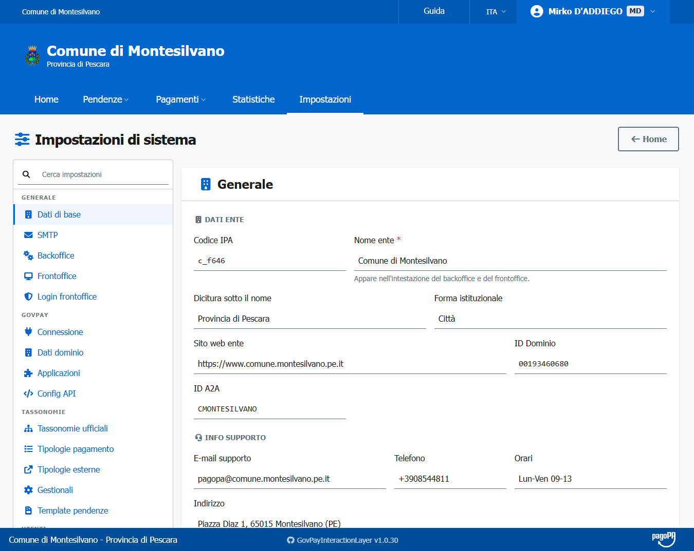
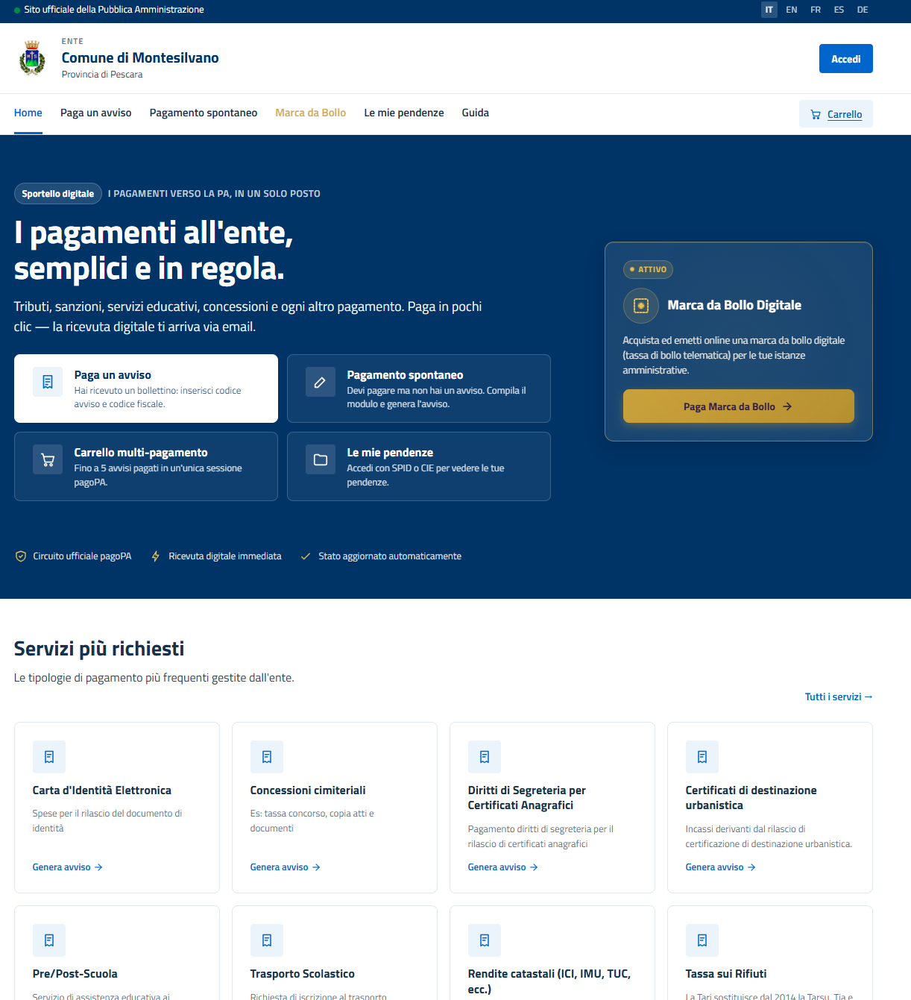

# GovPay Interaction Layer (GIL)

Piattaforma containerizzata (PHP/Apache + UI) per migliorare il flusso di lavoro degli enti che usano GovPay come soluzione PagoPA.

Include:
- **Backoffice** per operatori (gestione pendenze, flussi di rendicontazione, ricevute pagoPA on-demand)
- **Frontoffice** cittadini/sportello con supporto autenticazione OIDC esterna (opzionale)

Repository: https://github.com/Comune-di-Montesilvano/GovPay-Interaction-Layer.git  
License: European Union Public Licence v1.2 (EUPL-1.2)

---

## Interfaccia Grafica (Screenshots)

- **Backoffice (Gestione operativa & Impostazioni)**  
  

- **Frontoffice (Portale pagamenti cittadino)**  
  

---

## Indice

- [Interfaccia Grafica (Screenshots)](#interfaccia-grafica-screenshots)

- [Ambiente consigliato](#ambiente-consigliato)
- [Avvio rapido](#avvio-rapido)
- [Configurazione: .env](#configurazione-env)
- [Integrazioni API esterne](#integrazioni-api-esterne)
- [Autenticazione OIDC (opzionale)](#autenticazione-oidc-opzionale)
- [Setup produzione](#setup-produzione)
- [Rilasci e immagini Docker (GHCR)](#rilasci-e-immagini-docker-ghcr)
- [Processi batch](#processi-batch)
- [Funzionalità Backoffice](#funzionalità-backoffice)
- [Workflow di sviluppo](#workflow-di-sviluppo)
- [Troubleshooting](#troubleshooting)
- [Struttura del progetto](#struttura-del-progetto)

---

## Ambiente consigliato

L'ambiente di deploy **predefinito e consigliato** è uno **Stack Portainer**.

Portainer semplifica la gestione del ciclo di vita dello stack (deploy, aggiornamenti, rollback, log, variabili d'ambiente) senza richiedere accesso SSH diretto al server.

| Scenario | Strumento | Note |
|---|---|---|
| **Produzione** | **Portainer Stack** (Podman rootless) | Raccomandato — vedi [Setup produzione](#setup-produzione) |
| Sviluppo locale | Docker Compose CLI | `docker compose up -d --build` |
| CI/CD | GitHub Actions | Build + test automatici — vedi `.github/workflows/` |

> [!NOTE]
> In Portainer le variabili d'ambiente dello stack si inseriscono direttamente nell'editor dello Stack (sezione *Environment variables*), senza necessità di copiare il file `.env` sul server.

---

## Avvio rapido

> [!NOTE]
> Le immagini Docker sono **già pubblicate su GHCR**. Non è necessario clonare il repository né avere Git installato per un deploy di produzione.

### Prerequisiti

- Docker Engine + plugin `docker compose` (oppure Portainer con Podman rootless — [ambiente consigliato](#ambiente-consigliato))
- Porte libere sul tuo host (default): `8443` (backoffice), `8444` (frontoffice)

### 1. Scarica il file `docker-compose.yml`

```bash
curl -O https://raw.githubusercontent.com/Comune-di-Montesilvano/GovPay-Interaction-Layer/main/docker-compose.yml
```

In **Portainer**: usa *Stacks → Add stack → Repository* puntando al repository — non serve scaricare nulla manualmente. Vedi [Setup produzione](#setup-produzione).

### 2. Configura le variabili d'ambiente

Scarica il file d'esempio come riferimento:

```bash
curl -O https://raw.githubusercontent.com/Comune-di-Montesilvano/GovPay-Interaction-Layer/main/.env.example
cp .env.example .env
```

Il file contiene già **tutti i valori di default preimpostati**. Modifica solo le password e le chiavi crittografiche (indicate dai commenti). Tutto il resto — URL pubblici, integrazioni GovPay/pagoPA, branding — si configura dopo il primo avvio dal Backoffice → Impostazioni.

> [!NOTE]
> In **Portainer**: non serve il file `.env`. Inserisci le variabili direttamente in *Stacks → Editor → Environment variables*, usando `.env.example` come riferimento.

### 3. Avvia i container

```bash
# scarica le immagini pubblicate su GHCR e avvia
docker compose pull && docker compose up -d
```

> Vedi [Rilasci e immagini Docker (GHCR)](#rilasci-e-immagini-docker-ghcr) per i dettagli sulle immagini disponibili.

---

> **Sviluppo locale** — per lavorare sulle sorgenti è necessario clonare il repository:
> ```bash
> git clone https://github.com/Comune-di-Montesilvano/GovPay-Interaction-Layer.git
> cd GovPay-Interaction-Layer
> docker compose up -d --build
> ```
> Vedi [Workflow di sviluppo](#workflow-di-sviluppo) per dettagli.

### 4. Primo accesso

- Backoffice: https://localhost:8443
- Frontoffice: https://localhost:8444

Se non hai certificati TLS personalizzati in `ssl/`, vengono generati self-signed automaticamente; il browser mostrerà un avviso (normale in locale). Vedi [ssl/README.md](ssl/README.md).

### 5. Credenziali iniziali

Al primo accesso al backoffice viene avviata automaticamente la **procedura di setup guidata** per creare il primo superadmin e configurare le impostazioni di base.

In alternativa, è possibile pre-seeding il superadmin via variabili d'ambiente aggiungendo al `.env` (opzionale):

```env
ADMIN_EMAIL=admin@ente.gov.it
ADMIN_PASSWORD=password_sicura
```

Il seed è idempotente: viene eseguito solo se non esiste ancora un superadmin nel DB.

---

## Configurazione: `.env`

Il file `.env` contiene **solo le variabili di bootstrap** necessarie all'avvio dei container. Tutto il resto (GovPay, pagoPA, OIDC, branding, App IO, ecc.) si configura dall'interfaccia **Backoffice → Impostazioni** e viene salvato nel database.

```bash
cp .env.example .env
```

Le variabili obbligatorie prima del primo avvio:

| Variabile | Scopo |
|---|---|
| `DB_ROOT_PASSWORD`, `BACKOFFICE_DB_PASSWORD`, `FRONTOFFICE_DB_PASSWORD` | Credenziali database |
| `APP_ENCRYPTION_KEY` | Chiave cifratura segreti in DB — esattamente 32 caratteri (`openssl rand -hex 16`) |
| `MASTER_TOKEN` | Token Bearer per comunicazione interna backoffice ↔ frontoffice (`openssl rand -hex 24`) |

---

## Integrazioni API esterne

GIL si integra con i seguenti servizi esterni. Le variabili infrastrutturali/bootstrap stanno nel `.env`; la configurazione operativa si imposta dal backoffice in tabella `settings`.

| Integrazione | Scopo | Variabili `.env` |
|---|---|---|
| **GovPay** | Gestione pendenze, pagamenti, flussi di rendicontazione, backoffice | `GOVPAY_*_URL`, `AUTHENTICATION_GOVPAY` |
| **pagoPA Checkout** | Avvio pagamenti online tramite redirect al portale pagoPA | `PAGOPA_CHECKOUT_EC_BASE_URL`, `PAGOPA_CHECKOUT_SUBSCRIPTION_KEY` |
| **pagoPA Biz Events** | Recupero on-demand delle ricevute di pagamento dal dettaglio flusso | `BIZ_EVENTS_HOST`, `BIZ_EVENTS_API_KEY` |
| **App IO** | Invio messaggi e avvisi di pagamento ai cittadini (con CTA e dati avviso pagoPA) | `APP_IO_FEATURE_LEVEL_TYPE` (opz.); chiave API configurabile per tipologia |
| **OIDC Esterno** | Autenticazione cittadini nel frontoffice tramite proxy OIDC esterno | Backoffice → Impostazioni → Frontoffice — vedi sezione [Autenticazione OIDC](#autenticazione-oidc-opzionale) |

### Certificati client GovPay (mTLS)

Se `AUTHENTICATION_GOVPAY=ssl` o `sslheader`, GIL autentica le chiamate verso GovPay tramite certificato X.509 client.

Il flusso operativo corrente e' **UI first**:

- carica certificato e chiave dal backoffice durante il setup guidato oppure da **Impostazioni**
- il backoffice salva i file nel volume Docker `gil_certs`
- i path applicativi vengono registrati nel DB come `/var/www/certificate/govpay-cert.pem` e `/var/www/certificate/govpay-key.pem`

I path runtime attesi sono:

```env
GOVPAY_TLS_CERT=/var/www/certificate/govpay-cert.pem
GOVPAY_TLS_KEY=/var/www/certificate/govpay-key.pem
```

> [!WARNING]
> In deploy normali i certificati GovPay non vanno gestiti copiando file nel repository: vengono mantenuti nel volume `gil_certs` e aggiornati dalla UI. La cartella `certificate/` nella root ha senso solo come supporto locale/storico, non come flusso operativo principale.

Se la chiave privata e' protetta da password, valorizza anche `GOVPAY_TLS_KEY_PASSWORD`. In assenza dei file o con certificato scaduto le chiamate a GovPay falliscono a runtime.

Vedi [certificate/README.md](certificate/README.md) per dettagli su nomi file accettati e provenienza dei certificati.

---

## Autenticazione OIDC (opzionale)

Il frontoffice supporta l'autenticazione dei cittadini tramite un **proxy OIDC esterno** (ad es. [pa-sso-proxy](https://github.com/Comune-di-Montesilvano/pa-sso-proxy) o qualsiasi IdP compatibile OpenID Connect).

> [!NOTE]
> L'autenticazione è **completamente opzionale**. Con tipo impostato su "Nessuno" il frontoffice è ad accesso libero e non richiede login.

### Come configurare

1. Avvia lo stack normalmente
2. Apri **Backoffice → Impostazioni → Frontoffice**
3. Imposta **Tipo auth proxy** → `Esterno (OIDC Proxy)`
4. Compila i campi della sezione **Configurazione OIDC Proxy Esterno**:

| Campo | Descrizione |
|---|---|
| **OIDC Issuer (Base URL)** | URL pubblico del proxy OIDC (es. `https://sso.ente.gov.it`) |
| **Client ID** | Client ID registrato sul proxy |
| **Client Secret** | Client Secret (se richiesto dal proxy) |
| **OIDC Logout URL** | URL di logout remoto (es. `https://sso.ente.gov.it/logout`) |

5. Salva — il frontoffice utilizzerà immediatamente il nuovo provider

### Flusso di autenticazione

Il frontoffice implementa il flusso **Authorization Code + PKCE** (standard OAuth 2.0/OIDC):

```
Cittadino → GET /login
  → redirect a {OIDC_ISSUER}/OIDC/authorization?...
    → login sul proxy
      → redirect a {FRONTOFFICE_URL}/oidc/callback?code=...
        → scambio codice per token (POST /OIDC/token)
          → recupero claims da /OIDC/userinfo
            → sessione frontoffice creata
```

### Parametri da configurare sul proxy OIDC

Nel pannello di amministrazione del tuo proxy OIDC registra il client con:

| Parametro | Valore |
|---|---|
| **Redirect URI** | `{FRONTOFFICE_PUBLIC_BASE_URL}/oidc/callback` |
| **Allowed Scopes** | `openid profile email` |
| **Grant Type** | `authorization_code` |
| **PKCE** | Richiesto (`S256`) |

L'URL esatto della Redirect URI è visibile nella card informativa del tab Frontoffice in Impostazioni.

---

## Setup produzione

### Ambiente di produzione: Podman rootless + Portainer

> [!IMPORTANT]
> L'ambiente di produzione ufficiale è **Podman rootless gestito tramite Portainer**.
> Podman rootless garantisce isolamento dei container senza privilegi root sul sistema host, riducendo la superficie d'attacco.

**Requisiti sul server:**

```bash
# Podman + plugin docker-compose compatibile
podman --version          # >= 4.x
podman-compose --version  # oppure docker-compose con DOCKER_HOST=unix:///run/user/<uid>/podman/podman.sock

# Portainer Agent (o Portainer CE/BE già installato)
```

**Deploy tramite Portainer:**

1. In Portainer: *Stacks → Add stack → Repository*
2. URL repository: `https://github.com/Comune-di-Montesilvano/GovPay-Interaction-Layer.git`
3. Compose path: `docker-compose.yml`  
   (**non** selezionare `docker-compose.override.yml` — vedi sotto)
4. Inserisci le variabili d'ambiente nella sezione *Environment variables* dell'editor  
   (usa `.env.example` come riferimento)
5. Deploy

Per aggiornare lo stack a una nuova versione: modifica `APP_VERSION` nelle *Environment variables* → *Update the stack*.

> [!NOTE]
> In Podman rootless il DNS resolver della rete interna differisce da Docker. Se necessario imposta la variabile `NGINX_DNS_RESOLVER` con l'IP corretto (`podman network inspect <network-name>` → campo gateway).

---

### Volumi: regola aurea in produzione

> [!WARNING]
> **In produzione usare esclusivamente named volumes. I bind mount sono vietati.**
>
> Il `docker-compose.override.yml` presente nella root del repository aggiunge bind mount locali (`./debug:/var/www/html/public/debug`) pensati **esclusivamente per il debug in sviluppo locale**. In produzione questo file **non deve mai essere incluso nello stack**.

Il `docker-compose.yml` ufficiale usa già solo named volumes per tutti i dati persistenti:

| Volume | Contenuto | Persistenza |
|---|---|---|
| `gil_db_data` | Dati MariaDB | ⚠️ Critico — mai eliminare |
| `gil_ssl_certs` | Certificati TLS server | Da popolare prima del primo avvio |
| `gil_certs` | Certificati mTLS GovPay | Da popolare prima del primo avvio |
| `gil_images` | Immagini/loghi personalizzati | Caricati via Backoffice UI |
| `gil_backups` | Backup DB | Prodotti da script di backup |

**Backup dei volumi:** prima di qualsiasi aggiornamento dello stack esegui un backup dei volumi critici, in particolare `gil_db_data`.

```bash
# Esempio backup volume DB (da adattare all'ambiente Podman)
podman run --rm -v gil_db_data:/data -v $(pwd):/backup alpine \
  tar czf /backup/gil_db_data_$(date +%Y%m%d).tar.gz -C /data .
```

> [!CAUTION]
> **Non usare `docker-compose.override.yml` in produzione.** In Portainer, assicurati che il campo *Compose path* punti **solo** a `docker-compose.yml`. Se viene accidentalmente incluso l'override, i bind mount montano percorsi inesistenti sul server e causano errori di avvio.

---

### URL pubblici

In produzione evita `localhost`/`127.0.0.1`.

Imposta nel `.env` (o nelle *Environment variables* di Portainer):
```env
BACKOFFICE_PUBLIC_BASE_URL=https://backoffice.ente.gov.it
FRONTOFFICE_PUBLIC_BASE_URL=https://pagamenti.ente.gov.it
```

### Certificati TLS

Per HTTPS server (browser → applicazione), i certificati validi vanno nel volume `gil_ssl_certs`:
- `server.crt`
- `server.key`

In Portainer puoi popolare il volume prima del deploy tramite un container helper o `podman volume import`. Vedi [ssl/README.md](ssl/README.md) per dettagli e troubleshooting permessi.

I certificati in `gil_certs` sono distinti: servono per l'autenticazione client verso GovPay (mTLS app → GovPay). Vedi [certificate/README.md](certificate/README.md).

### Reverse proxy

Pattern consigliato: reverse proxy pubblico (porta 443) → container interno.

Header da preservare:
```
Host: <hostname pubblico>
X-Forwarded-Proto: https
X-Forwarded-For: <IP client>
```

Imposta `SSL=off` nel `.env` se il reverse proxy termina TLS e il container riceve HTTP interno.

### Immagini Docker pre-buildate

In produzione non è necessario clonare il repository completo né avere un ambiente Node.js o Composer installato. Usa direttamente le immagini pubblicate su GHCR:

```bash
docker compose pull
docker compose up -d
```

Le immagini sono pubblicate automaticamente a ogni tag `vX.Y.Z` su:
- `ghcr.io/comune-di-montesilvano/govpay-interaction-layer-backoffice`
- `ghcr.io/comune-di-montesilvano/govpay-interaction-layer-frontoffice`
- `ghcr.io/comune-di-montesilvano/govpay-interaction-layer-db`

Per un server di produzione sono sufficienti: il `docker-compose.yml` e le variabili d'ambiente (tramite `.env` o Portainer).

---

## Rilasci e immagini Docker (GHCR)

### Flusso di rilascio

Ogni release è associata a un tag Git `vX.Y.Z`. Al push del tag, il workflow GitHub Actions `.github/workflows/docker-publish.yml` builda e pubblica automaticamente le immagini Docker su GHCR con i tag `:vX.Y.Z`, `:X.Y` e `:latest`.

```bash
# Avanzare di versione
git tag vX.Y.Z
git push origin vX.Y.Z
```

Il workflow parte automaticamente. Puoi seguire l'avanzamento su GitHub → Actions → "Docker Publish".

### Immagini disponibili

| Immagine | Scopo |
|---|---|
| `govpay-interaction-layer-backoffice` | Applicazione backoffice (PHP/Apache) |
| `govpay-interaction-layer-frontoffice` | Applicazione frontoffice (PHP/Apache) |
| `govpay-interaction-layer-db` | Database MariaDB con schema iniziale |

Registry: `ghcr.io/comune-di-montesilvano/`

### Sviluppo vs produzione

| | Sviluppo | Produzione |
|---|---|---|
| **Avvio** | `docker compose up -d --build` | `docker compose pull && docker compose up -d` |
| **Immagini** | Build locali da Dockerfile | Pre-buildate da GHCR |
| **Debug mount** | `docker-compose.override.yml` caricato automaticamente | Non presente (o da rimuovere) |
| **Certificati TLS** | Self-signed (auto-generati) | Validi in `ssl/` |

---

## Processi batch

I daemon principali (`cron_ragioneria.php`, `cron_tefa_scanner.php`, `cron_pendenze_massive.php`) si gestiscono da **Impostazioni → Cron** nel backoffice (start/stop/log/autostart). Possono anche essere avviati manualmente:

```bash
# Daemon ragioneria (sincronizza flussi GovPay → DB)
docker exec -d gil-backoffice php /var/www/html/scripts/cron_ragioneria.php

# Daemon TEFA scanner (elabora IUR via Biz Events)
docker exec -d gil-backoffice php /var/www/html/scripts/cron_tefa_scanner.php

# Pendenze massive (one-shot o in loop)
docker exec gil-backoffice php /var/www/html/scripts/cron_pendenze_massive.php
```

### Inserimento massivo pendenze

Lo script elabora i lotti caricati via interfaccia web (stato `PENDING`) e li invia a GovPay.

```bash
# Esecuzione manuale
docker exec gil-backoffice php /var/www/html/scripts/cron_pendenze_massive.php
```

**Schedulazione crontab** (ogni 5 minuti):
```cron
*/5 * * * * docker exec gil-backoffice php /var/www/html/scripts/cron_pendenze_massive.php >> /var/log/gil_cron.log 2>&1
```

**Schedulazione systemd timer** (consigliato in produzione):

`/etc/systemd/system/gil-pendenze.service`:
```ini
[Unit]
Description=GIL Inserimento Massivo Pendenze
After=network.target

[Service]
Type=oneshot
ExecStart=/usr/bin/docker exec gil-backoffice php /var/www/html/scripts/cron_pendenze_massive.php
```

`/etc/systemd/system/gil-pendenze.timer`:
```ini
[Unit]
Description=GIL Pendenze ogni 5 minuti

[Timer]
OnBootSec=1min
OnUnitActiveSec=5min

[Install]
WantedBy=timers.target
```

---

## Funzionalità Backoffice

### Gestione Pendenze

- Ricerca, inserimento singolo e massivo.
- Dettaglio con azioni: annullamento, stralcio, riattivazione.
- Storico modifiche in `datiAllegati`; origine e operatore tracciati.
- **IUV vincolato (`iuv_prefix`)**: per tipologia si può configurare un prefisso (max 10 cifre) che forza `idPendenza` e `numeroAvviso` a essere avvisi pagoPA a 18 cifre con quel prefisso. Si imposta da Impostazioni → Configurazione tipologie.
- **Marca da Bollo Telematica (@e.bollo)**: integrazione del flusso completo per l'acquisto e validazione di marche da bollo digitali direttamente collegate alle posizioni debitorie.
- **Rateizzazione Automatica e Lineare**: pianificatore di rate in tempo reale. I ricalcoli di date, frequenze e redistribuzioni degli importi residui avvengono automaticamente in JS alla modifica di qualsiasi campo, offrendo un flusso lineare e senza la necessità di cliccare pulsanti manuali.

### Flussi di Rendicontazione

- Ricerca per data, PSP, stato con paginazione e filtri.
- Dettaglio flusso con IUV, causale, importo, esito.
- **Ricevute on-demand (Biz Events)**: per pagamenti "orfani" (senza dati GovPay locali), un pulsante carica la ricevuta pagoPA via AJAX mostrando debitore, pagatore, PSP, importi e trasferimenti.
- **Cache DB locale**: i flussi GovPay vengono sincronizzati nella tabella `flussi_rendicontazioni` dal daemon ragioneria — i report leggono da cache locale anziché interrogare GovPay in real-time.

### Statistiche e Dashboard Real-Time

- **Dashboard operativa premium**: report combinati tramite Chart.js degli andamenti mensili (transazioni e volumi), doughnut split tra flussi interni (GovPay) ed esterni (Biz Events).
- **Ripartizione Entrate**: analisi della quota di incassi per singola tipologia di pendenza (Top 6 automatica in base al volume raccolto, espandibile interattivamente a tutte le tipologie tramite toggle asincrono).
- **GIL Services Hub (Home)**: pannello di controllo in tempo reale dello stato di salute dei demoni contabili (`ragioneria`, `biz`, `tefa`, `pendenze-massive`), con pulsanti AJAX dedicati per avviare/arrestare i processi direttamente dalla home page (riservato ai `superadmin`).

### Ottimizzazione UI & Datepicker Contabile

- **Interfaccia ad alto contrasto**: badges di stato riprogettati con sfondi pastello morbidi e contorni coordinati ad alta leggibilità. Sidebar con icone FontAwesome sotto-voci per una chiara gerarchia visiva. Card header compatti allineati a sinistra con paginazione in linea.
- **Datepicker sbloccato**: Premium Date Picker (Litepicker) che consente la digitazione manuale da tastiera (con validatore date integrato) e comodi pulsanti pillola per le scorciatoie di ragioneria (*Mese Corrente*, *Mese Precedente*, *Anno Corrente*, *Anno Precedente*, *Azzera*) uniformati su tutti i 6 moduli di ricerca e report del backoffice. Disposizione orizzontale affiancata priva di wrapping orizzontale.

### Report Pagamenti

#### Report Ragioneria (`/pagamenti/report-ragioneria`)

- Primo accesso senza esecuzione automatica: il report parte solo dopo click su `Aggiorna`.
- Filtri con UX avanzata: intervallo date con datepicker, multi-selezione tipologie con ricerca, filtri avanzati (parametri GovPay).
- Esecuzione asincrona con barra di avanzamento e stato backend.
- Cache persistente su volume Docker con pulsante `Rigenera cache`.
- Riepilogo per tipologia ordinabile lato client.
- Dettaglio rendicontazioni paginato (50 righe/pagina) con export CSV.
- Link rapido alla pendenza: apre direttamente il dettaglio (se `id_pendenza` disponibile) o la ricerca per IUV.

#### Report TEFA (`/pagamenti/report-tefa`)

- Stato copertura TEFA: contatori PENDING / PROCESSED / ERROR / SKIPPED per flusso.
- View copertura con percentuale elaborazione per singolo flusso.
- Export CSV dei dati elaborati.
- Alimentato dal daemon `cron_tefa_scanner.php` che arricchisce le IUR via Biz Events.

#### Report Incassi (`/pagamenti/incassi-tassonomia`)

- Primo accesso senza ricerca automatica (coerente con Report Ragioneria).
- Maschera filtri allineata al Report Ragioneria: datepicker range, selettore tipologie con ricerca (TomSelect), filtri avanzati.
- Tabella dettaglio con descrizione tipologia (`tassonomia_label`) in luogo del valore tecnico raw.
- Link rapido alla pendenza nella griglia dettaglio con stessa logica del Report Ragioneria.

### Impostazioni → Cron (gestione daemon)

Il tab **Impostazioni → Cron** gestisce i daemon di background:

| Daemon | Scopo |
|---|---|
| `cron_biz_scanner.php` | Scansiona i Biz Events e popola `biz_ricevute` |
| `cron_ragioneria.php` | Sincronizza flussi GovPay nella tabella `flussi_rendicontazioni`; ciclo ogni 30 min |
| `cron_tefa_scanner.php` | Processa IUR dalla cache, arricchisce via Biz Events per TEFA |
| `cron_pendenze_massive.php` | Elabora lotti pendenze massive in stato `PENDING` |

- **Autostart**: se il flag autostart è attivo per un daemon, `docker-setup.sh` lo riavvia automaticamente a ogni rebuild del container.
- **Log viewer**: log file-based consultabili dall'interfaccia backoffice.
- **Data di scansione ragioneria**: configurabile dal tab Cron (impostazione `ragioneria_scan_da`).

---

## Workflow di sviluppo

```bash
# Rebuild dopo modifiche a PHP/composer/asset
docker compose up -d --build

# Log in tempo reale
docker compose logs -f

# Shell nel container backoffice
docker compose exec backoffice bash
```

#### Override per sviluppo locale (solo dev)

Il file `docker-compose.override.yml` viene caricato **automaticamente** da `docker compose` se presente nella stessa directory. Aggiunge bind mount locali (`./debug:/var/www/html/public/debug`) su backoffice e frontoffice per utility di test live.

> [!WARNING]
> **`docker-compose.override.yml` è esclusivamente per sviluppo locale.** Non copiarlo né includerlo in produzione. Per avviare esplicitamente senza override:
> ```bash
> docker compose -f docker-compose.yml up -d
> ```
> In Portainer, il campo *Compose path* deve puntare **solo** a `docker-compose.yml`.

Struttura codice:
- `backoffice/` — applicazione backoffice
- `frontoffice/` — applicazione frontoffice
- `app/` — librerie PHP condivise
- `backoffice/templates/` e `frontoffice/templates/` — template Twig

---

## Troubleshooting

### Variabili "annidate" nei file env

Docker Compose **non espande** variabili del tipo `FOO="${BAR}"` negli `env_file`. Usa valori espliciti.

### Script `.sh` e line ending

Gli script devono usare LF (non CRLF). Questo repository forza i line ending via `.gitattributes`.

### Container backoffice non parte

Controlla i log: `docker compose logs backoffice` oppure `docker logs gil-backoffice`

Cause comuni:
- `.env` mancante o con variabili obbligatorie vuote
- certificati in `ssl/` non leggibili dal container (vedi [ssl/README.md](ssl/README.md))
- database non ancora pronto (il container riprova automaticamente)

---

## Struttura del progetto

```
GovPay-Interaction-Layer/
├── docker-compose.yml
├── docker-compose.override.yml   # override sviluppo (debug mount — non usare in prod)
├── Dockerfile
├── .env                          # da creare (non versionato)
├── .env.example                  # template per .env
├── .github/workflows/
│   ├── ci.yml                    # CI: test PHP su push/PR
│   └── docker-publish.yml        # CD: build e push immagini GHCR su tag vX.Y.Z
├── backoffice/               # applicazione backoffice (Slim 4 + Twig)
├── frontoffice/              # applicazione frontoffice
├── app/                      # codice PHP condiviso
├── docker/
│   └── db/Dockerfile         # immagine govpay-db
├── ssl/                      # certificati TLS server (browser → app) — vedi ssl/README.md
├── certificate/              # certificati client GovPay (app → GovPay) — vedi certificate/README.md
├── img/                      # immagini/loghi — vedi img/README.md
├── scripts/                  # script di utilità runtime (cron)
├── migrations/               # migrazioni DB
├── govpay-clients/           # client API GovPay generati
├── pagopa-clients/           # client API pagoPA generati
└── debug/                    # tool debug (montati solo in sviluppo via override)
```

---

## Contribuire

1. Fork del repository
2. Crea un branch: `git checkout -b feature/nuova-funzionalita`
3. Commit: `git commit -m "feat: descrizione"`
4. Push: `git push origin feature/nuova-funzionalita`
5. Apri una Pull Request

## Supporto

- Issues: https://github.com/Comune-di-Montesilvano/GovPay-Interaction-Layer/issues

